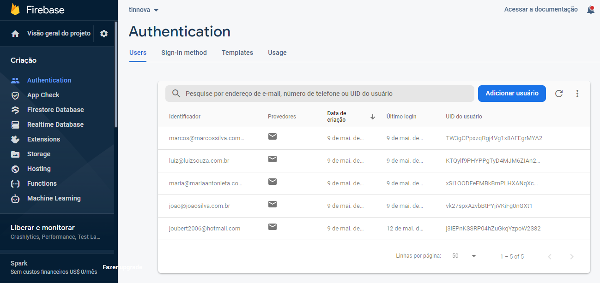

# Teste TINNOVA &middot; 

> O Desafio
Seu objetivo é criar um simples app que deve conter duas páginas, uma que exibe um
formulário com os campos abaixo, e outra que liste os dados cadastrados.
• Nome completo
• CPF
• Telefone
• Email

</br>

> Pré-requisitos:
• Deve ser possível criar, listar e excluir os dados cadastrados pelo formulário;
• Os inputs de texto e botão devem ter a aparência conforme o guia de estilo abaixo (com
validações);
• Fazer a persistência dos dados no localStorage ou IndexedDB;
• Recomendado uso de ECMAScript 6+ e React.JS;

</br>

> Dados Iniciais
[
 {
 "name": "Joao da Silva",
 "cpf": "26899337649",
 "phone": "4233335555",
 "email": "joao@joaosilva.com.br"
 },
 {
 "name": "Maria Antonieta",
 "cpf": "65138896180",
 "phone": "1255553333",
 "email": "maria@mariaantonieta.com.br"
 },
 {
 "name": "Luiz Souza",
 "cpf": "32420496329",
 "phone": "1144446666",
Rua Jurema Vieira Medrado, 88 | Sala 405 | São José dos Campos-SP | CEP 12246-180
(12) 3322-4656 | www.tinnova.com.br
 "email": "luiz@luizsouza.com.br"
 }
];

</br>


</br>
## O que foi feito

- No lugar de só salvar os dados localmente, cadastrei esses usuários em um banco de dados na núvem(Firebase). Podendo fazer o login com esses e-mails e CPFs, pode criar uma conta e pode fazer alteração de qualquer usuário.

- Verificações adicionadas:
-Nome - só é possível salver acima de 3 caracteres
-E-mail - só é possível salver se for e-mail válido - email@email.com
-Cpf - só é possível salver se conter os 11 dígitos
-Celular - só é possível salvar se conter no mínimo 10 caracteres

# Link para download android

- [APK](https://drive.google.com/file/d/1opA1HqCWsFycMf6S71ypMmAA14zmAtlO/view?usp=sharing)

</br>

## Installing / Getting started

```bash
# Clone o repositório
$ git clone git@github.com:alexjou/tinnova.git

# Entre na pasta
$ cd tinnova

# Instale as dependencias
$ yarn install

# Inicie o site
$ yarn start
```

## Developing

- [Expo](https://expo.io/)
- [React Native](https://reactnative.dev/)
- [Yarn Workspaces](https://classic.yarnpkg.com/en/docs/workspaces/)
- [Firebase](https://firebase.google.com/)


## Database

- [Firebase - Authentication](https://firebase.google.com/docs/auth?hl=pt-br)

Responsavel por fazer a autenticação de novos usuários, criando um ID único.



- [Firebase - Firestore](https://firebase.google.com/docs/firestore?hl=pt-br)

Responsavel por salvar os dados para exibição e edição de novos usuários, cadastrando com o mesmo ID criando na autenticação.


</br>

